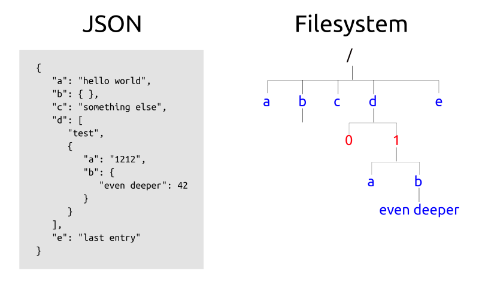

# JSON2FS - Mapping JSON as a File System

Mapping JSON to a file system . . . because it's possible, and because how it should be done - bridging datasets to different views.



```
% more test.json
{  
   "a": "hello world",
   "b": { },
   "c": "something else",
   "d": [
      "test",
      {  
         "a": "1212",
         "b": {
            "even deeper": 42
         }
      }
   ],
   "e": "last entry"
}

% json2fs test.json

% cd test/

% ls
a  b/  c  d/  e

% more a
hello world

% more d/1/b/even\ deeper
42

% echo "God" > d/1/b/even\ deeper

% more d/1/b/even\ deeper
God

```

## Support
- Debian/Ubuntu 18.04/LTS
- read and write:
  - writing (enabled by default):
    - `mkdir dir` => { }
    - `mkdir dir@` => [ ]
      - sub-items referenced by `0`, `1`, ..
  - read-only: use `-r` or `--read_only` switch

## Limitations
- highly experimental (unstable)

## Todo
- content which clashes with UNIX filename notion:
  - large or long content
  - \r \n or general non-printable content (e.g. binary)
- ~~"write" support~~: added with 0.0.2
- deal with huge JSON datasets (and long wait times):
  
## Download
```
% git clone https://github.com/Spiritdude/JSON2FS
% cd JSON2FS
```

## Install

On Debian/Ubuntu 18.04:
```
% sudo make requirements
% make install
```
Note: it just installs `json2fs` to your local `~/bin/`.

## Usage

```
USAGE JSON2FS (json2fs) 0.0.2: [<options>] <file.json>
   options:
      --verbose            increase verbosity
        -v or -vvvv           "       "
      --version            print version and exit
      --allow_other        permit other users to use mount (add 'user_allow_other' in /etc/fuse.conf)
      --read_only          make it read only, don't write back to JSON file
        -r 
      --mount=<dir>        enforce certain mount point
      --hash_prefix=<p>    define hash prefix (default: x)

   examples:
      % json2fs test.json
      % cd test/
      % ls 

   see also https://github.com/Spiritdude/JSON2FS for more information
   
```

## Real World Usage
```
% ./json2fs test.json

% cd test/

% ls -R
.:
a  b/  c  d/  e

./b:

./d:
0  1/

./d/1:
a  b/

./d/1/b:
'even deeper'

$ more d/1/b/even\ deeper 
42
```

## Exit & Unmount
```
% sudo umount test/
```

## Extended Use

Add in `/etc/fuse.conf`:
```
user_allow_other
```

so other users, like a web-server (lighttpd/apache/nginx) can access those mounted database/directories as well.

